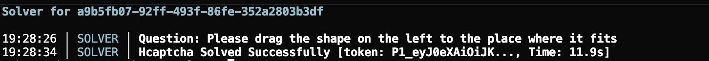

# hCaptcha Solver



Automated hCaptcha solving using AI vision models. Works with Discord and other sites that use hCaptcha.

## What it does

This tool automatically solves hCaptcha challenges by:
- Using Multibot API for solving challenges
- Falling back to Groq's vision models when Multibot is unavailable
- Generating realistic mouse movement patterns
- Handling different challenge types (image selection, drag-drop, etc.)

## Setup

### Requirements

```bash
pip install tls-client camoufox colorama requests httpx asyncio jwt
```

You'll also need:
- A Groq API key (get one at [console.groq.com](https://console.groq.com))
- A Multibot API key (required for mouse movement generation)

### Configuration

Edit `config.json`:

```json
{
  "GROQ_API_KEY": "your-groq-api-key-here",
  "MULTIBOT_API_KEY": "your-multibot-key-here",
  "models": {
    "vision_model": "meta-llama/llama-4-scout-17b-16e-instruct",
    "fallback_model": "llama-3.1-8b-instant"
  },
  "debug": false
}
```

The Multibot API key is required for mouse movement generation. Without it, the solver won't work.

## Usage

### Basic example

```python
from solver import HCaptchaSolver

solver = HCaptchaSolver(
    sitekey="a9b5fb07-92ff-493f-86fe-352a2803b3df",
    host="discord.com",
    rqdata=None,  # Optional: request data if required by the site
    real_time_mode=True
)

result = await solver.solve_captcha()

if result.get('success'):
    token = result.get('token')
    print(f"Got token: {token}")
else:
    print(f"Failed: {result.get('error')}")
```

### With proxy

```python
solver = HCaptchaSolver(
    sitekey="your-sitekey",
    host="example.com",
    rqdata=None,  # Optional: request data if required by the site
    proxy="username:password@ip:port"
)
```

### Running the example

```bash
python solver.py
```

The main function in `solver.py` has a Discord example hardcoded. Just run it and it'll solve a challenge.

## How it works

1. **Gets site config** - Fetches the hCaptcha configuration for the target site
2. **Fetches challenge** - Retrieves the actual challenge (images, questions, etc.)
3. **Solves with AI** - Uses Groq vision models or Multibot API to analyze and solve
4. **Generates motion data** - Creates realistic mouse movements for the submission
5. **Submits solution** - Sends the answer back to hCaptcha

The solver handles multiple challenge types:
- `image_label_binary` - Click all images that match
- `image_label_area_select` - Click on specific areas
- `image_drag_drop` - Drag objects to correct positions

## Features

- **Multiple AI backends** - Groq for vision, Multibot for solving and mouse movements
- **Realistic mouse movements** - Generates human-like cursor paths
- **Automatic retries** - Handles failures and retries up to 15 times
- **Debug logging** - Clean, colorized logs when debug mode is enabled
- **Proxy support** - Works with HTTP proxies

## Notes

- Success rate depends on your API keys and the challenge difficulty
- The solver uses a headless browser (Camoufox) for HSW token generation
- Multibot API key is required for mouse movement generation

## Troubleshooting

**"MULTIBOT_API_KEY not configured"**
- You need a Multibot API key for mouse movement generation. Get one at multibot.in

**Low success rate**
- Try enabling Multibot API if you're only using Groq
- Some challenges are harder than others - the solver will retry automatically

**HSW token generation fails**
- Make sure you have Camoufox installed
- Check your proxy settings if using one

## License

[MIT License](https://github.com/scremermemer/hcaptcha-solver/blob/main/LICENSE)

Use at your own risk. This is for educational purposes.

